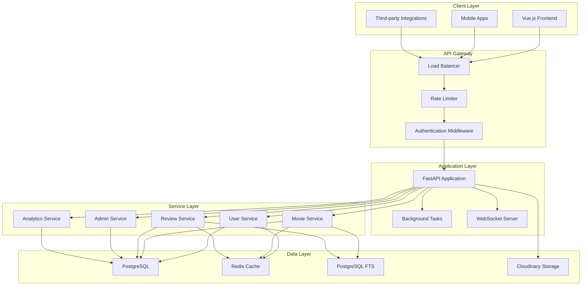

# LemonNPie Backend API Design

## Overview

The LemonNPie Backend API is a comprehensive Python FastAPI application designed to support a Nollywood movie review platform. The system provides RESTful endpoints for user management, movie/series data, reviews, social features, and administrative functions. The architecture emphasizes scalability, performance, and maintainability while supporting the existing Vue.js frontend and future mobile applications.

## Architecture

### High-Level Architecture



### Technology Stack

- **Framework**: FastAPI 0.104+ with Python 3.11+
- **Database**: PostgreSQL 15+ with SQLAlchemy 2.0 ORM
- **Cache**: Redis 7+ for session storage and caching
- **Search**: PostgreSQL Full-Text Search with custom indexing
- **File Storage**: Cloudinary for image/video management
- **Authentication**: JWT with PyJWT
- **Background Tasks**: Celery with Redis broker
- **API Documentation**: OpenAPI 3.0 with Swagger UI
- **Monitoring**: Prometheus metrics with Grafana dashboards
- **Testing**: Pytest with async support

## Components and Interfaces

### 1. Authentication & Authorization

#### JWT Token Structure
```python
{
    "sub": "user_id",
    "email": "user@example.com",
    "role": "user|critic|moderator|admin",
    "exp": 1234567890,
    "iat": 1234567890,
    "jti": "token_id"
}
```

#### Role-Based Access Control
- **User**: Basic access to read content, write reviews, manage personal data
- **Critic**: Enhanced review features, verified badge
- **Moderator**: Content moderation capabilities
- **Admin**: Full system access including user management

#### Security Features
- Password hashing with bcrypt
- Rate limiting per endpoint and user
- CORS configuration for frontend domains
- Request validation and sanitization
- SQL injection prevention through ORM

### 2. API Endpoints Structure

#### Authentication Endpoints
```
POST /api/v1/auth/register
POST /api/v1/auth/login
POST /api/v1/auth/refresh
POST /api/v1/auth/logout
POST /api/v1/auth/forgot-password
POST /api/v1/auth/reset-password
GET  /api/v1/auth/verify-email/{token}
```

#### User Management Endpoints
```
GET    /api/v1/users/profile
PUT    /api/v1/users/profile
GET    /api/v1/users/{user_id}
GET    /api/v1/users/{user_id}/reviews
GET    /api/v1/users/{user_id}/followers
GET    /api/v1/users/{user_id}/following
POST   /api/v1/users/{user_id}/follow
DELETE /api/v1/users/{user_id}/follow
GET    /api/v1/users/watchlist
POST   /api/v1/users/watchlist/{movie_id}
DELETE /api/v1/users/watchlist/{movie_id}
GET    /api/v1/users/favorites
POST   /api/v1/users/favorites/{movie_id}
DELETE /api/v1/users/favorites/{movie_id}
```

#### Movie & Series Endpoints
```
GET    /api/v1/movies
GET    /api/v1/movies/{movie_id}
GET    /api/v1/movies/search
GET    /api/v1/movies/featured
GET    /api/v1/movies/trending
GET    /api/v1/movies/{movie_id}/reviews
GET    /api/v1/series
GET    /api/v1/series/{series_id}
GET    /api/v1/series/search
```

#### Review Endpoints
```
GET    /api/v1/reviews
POST   /api/v1/reviews
GET    /api/v1/reviews/{review_id}
PUT    /api/v1/reviews/{review_id}
DELETE /api/v1/reviews/{review_id}
POST   /api/v1/reviews/{review_id}/vote
DELETE /api/v1/reviews/{review_id}/vote
GET    /api/v1/reviews/trending
```

#### Admin Endpoints
```
GET    /api/v1/admin/dashboard
GET    /api/v1/admin/users
PUT    /api/v1/admin/users/{user_id}/role
POST   /api/v1/admin/users/{user_id}/suspend
GET    /api/v1/admin/reports
PUT    /api/v1/admin/reports/{report_id}/resolve
GET    /api/v1/admin/moderation
POST   /api/v1/admin/moderation/{content_id}
GET    /api/v1/admin/analytics
```

### 3. Database Schema Design

#### Extensions and Setup
```sql
-- Enable required PostgreSQL extensions
CREATE EXTENSION IF NOT EXISTS "uuid-ossp";
CREATE EXTENSION IF NOT EXISTS "pg_trgm";  -- For trigram similarity search
CREATE EXTENSION IF NOT EXISTS "unaccent"; -- For accent-insensitive search

-- Create custom types
CREATE TYPE user_role AS ENUM ('user', 'critic', 'moderator', 'admin');
CREATE TYPE content_type AS ENUM ('movie', 'series');
CREATE TYPE moderation_status AS ENUM ('pending', 'approved', 'rejected');
CREATE TYPE vote_type AS ENUM ('helpful', 'unhelpful');
CREATE TYPE cast_role AS ENUM ('actor', 'director', 'producer', 'writer');
```

#### Core Tables

**users**
```sql
CREATE TABLE users (
    id UUID PRIMARY KEY DEFAULT gen_random_uuid(),
    email VARCHAR(255) UNIQUE NOT NULL,
    password_hash VARCHAR(255) NOT NULL,
    name VARCHAR(255) NOT NULL,
    bio TEXT,
    location VARCHAR(255),
    avatar_url VARCHAR(500),
    role user_role DEFAULT 'user',
    is_active BOOLEAN DEFAULT true,
    is_verified BOOLEAN DEFAULT false,
    login_attempts INTEGER DEFAULT 0,
    locked_until TIMESTAMP,
    created_at TIMESTAMP DEFAULT CURRENT_TIMESTAMP,
    updated_at TIMESTAMP DEFAULT CURRENT_TIMESTAMP
);
```

**movies**
```sql
CREATE TABLE movies (
    id UUID PRIMARY KEY DEFAULT gen_random_uuid(),
    title VARCHAR(500) NOT NULL,
    local_title VARCHAR(500),
    release_date DATE NOT NULL,
    runtime INTEGER,
    plot_summary TEXT,
    poster_url VARCHAR(500),
    trailer_url VARCHAR(500),
    director VARCHAR(255),
    producer VARCHAR(255),
    production_company VARCHAR(255),
    production_state VARCHAR(100),
    box_office_ng VARCHAR(100),
    type content_type DEFAULT 'movie',
    created_at TIMESTAMP DEFAULT CURRENT_TIMESTAMP,
    updated_at TIMESTAMP DEFAULT CURRENT_TIMESTAMP
);
```

**reviews**
```sql
CREATE TABLE reviews (
    id UUID PRIMARY KEY DEFAULT gen_random_uuid(),
    user_id UUID REFERENCES users(id) ON DELETE CASCADE,
    movie_id UUID REFERENCES movies(id) ON DELETE CASCADE,
    lemon_pie_rating INTEGER CHECK (lemon_pie_rating >= 1 AND lemon_pie_rating <= 10),
    review_text TEXT NOT NULL,
    review_language VARCHAR(10) DEFAULT 'en',
    spoiler_warning BOOLEAN DEFAULT false,
    cultural_authenticity_rating INTEGER CHECK (cultural_authenticity_rating >= 1 AND cultural_authenticity_rating <= 10),
    production_quality_rating INTEGER CHECK (production_quality_rating >= 1 AND production_quality_rating <= 10),
    story_rating INTEGER CHECK (story_rating >= 1 AND story_rating <= 10),
    acting_rating INTEGER CHECK (acting_rating >= 1 AND acting_rating <= 10),
    cinematography_rating INTEGER CHECK (cinematography_rating >= 1 AND cinematography_rating <= 10),
    helpful_votes INTEGER DEFAULT 0,
    unhelpful_votes INTEGER DEFAULT 0,
    is_flagged BOOLEAN DEFAULT false,
    moderation_status moderation_status DEFAULT 'approved',
    created_at TIMESTAMP DEFAULT CURRENT_TIMESTAMP,
    updated_at TIMESTAMP DEFAULT CURRENT_TIMESTAMP,
    UNIQUE(user_id, movie_id)
);
```

#### Relationship Tables

**movie_genres**
```sql
CREATE TABLE movie_genres (
    movie_id UUID REFERENCES movies(id) ON DELETE CASCADE,
    genre VARCHAR(100) NOT NULL,
    PRIMARY KEY (movie_id, genre)
);
```

**movie_languages**
```sql
CREATE TABLE movie_languages (
    movie_id UUID REFERENCES movies(id) ON DELETE CASCADE,
    language VARCHAR(50) NOT NULL,
    PRIMARY KEY (movie_id, language)
);
```

**movie_cast**
```sql
CREATE TABLE movie_cast (
    movie_id UUID REFERENCES movies(id) ON DELETE CASCADE,
    actor_name VARCHAR(255) NOT NULL,
    character_name VARCHAR(255),
    role_type cast_role DEFAULT 'actor',
    PRIMARY KEY (movie_id, actor_name, character_name)
);
```

**user_follows**
```sql
CREATE TABLE user_follows (
    follower_id UUID REFERENCES users(id) ON DELETE CASCADE,
    following_id UUID REFERENCES users(id) ON DELETE CASCADE,
    created_at TIMESTAMP DEFAULT CURRENT_TIMESTAMP,
    PRIMARY KEY (follower_id, following_id),
    CHECK (follower_id != following_id)
);
```

**user_watchlist**
```sql
CREATE TABLE user_watchlist (
    user_id UUID REFERENCES users(id) ON DELETE CASCADE,
    movie_id UUID REFERENCES movies(id) ON DELETE CASCADE,
    added_at TIMESTAMP DEFAULT CURRENT_TIMESTAMP,
    PRIMARY KEY (user_id, movie_id)
);
```

**review_votes**
```sql
CREATE TABLE review_votes (
    user_id UUID REFERENCES users(id) ON DELETE CASCADE,
    review_id UUID REFERENCES reviews(id) ON DELETE CASCADE,
    vote_type vote_type NOT NULL,
    created_at TIMESTAMP DEFAULT CURRENT_TIMESTAMP,
    PRIMARY KEY (user_id, review_id)
);
```

### 4. Caching Strategy

#### Redis Cache Structure
```python
# User sessions
"session:{user_id}" -> {user_data, expires_in}

# Movie data cache
"movie:{movie_id}" -> {movie_data, ttl: 1hour}
"movies:trending" -> {movie_list, ttl: 15min}
"movies:featured" -> {movie_list, ttl: 30min}

# Review aggregations
"movie:{movie_id}:stats" -> {avg_rating, review_count, ttl: 5min}
"reviews:trending" -> {review_list, ttl: 10min}

# Search results
"search:movies:{query_hash}" -> {results, ttl: 30min}
"search:suggestions:{partial_query}" -> {suggestions, ttl: 1hour}

# User activity feeds
"feed:{user_id}" -> {activities, ttl: 5min}
```

### 5. Search Implementation

#### PostgreSQL Full-Text Search Setup
```sql
-- Create search index table for movies
CREATE TABLE movie_search_index (
    movie_id UUID PRIMARY KEY REFERENCES movies(id) ON DELETE CASCADE,
    search_vector tsvector,
    title_vector tsvector,
    content_vector tsvector,
    updated_at TIMESTAMP DEFAULT CURRENT_TIMESTAMP
);

-- Create GIN indexes for fast text search
CREATE INDEX idx_movie_search_vector ON movie_search_index USING GIN(search_vector);
CREATE INDEX idx_movie_title_vector ON movie_search_index USING GIN(title_vector);
CREATE INDEX idx_movie_content_vector ON movie_search_index USING GIN(content_vector);

-- Function to update search vectors
CREATE OR REPLACE FUNCTION update_movie_search_vector()
RETURNS TRIGGER AS $$
BEGIN
    INSERT INTO movie_search_index (movie_id, search_vector, title_vector, content_vector)
    VALUES (
        NEW.id,
        to_tsvector('english', 
            COALESCE(NEW.title, '') || ' ' ||
            COALESCE(NEW.local_title, '') || ' ' ||
            COALESCE(NEW.director, '') || ' ' ||
            COALESCE(NEW.producer, '') || ' ' ||
            COALESCE(NEW.production_company, '') || ' ' ||
            COALESCE(NEW.production_state, '')
        ),
        to_tsvector('english', COALESCE(NEW.title, '') || ' ' || COALESCE(NEW.local_title, '')),
        to_tsvector('english', COALESCE(NEW.plot_summary, ''))
    )
    ON CONFLICT (movie_id) DO UPDATE SET
        search_vector = EXCLUDED.search_vector,
        title_vector = EXCLUDED.title_vector,
        content_vector = EXCLUDED.content_vector,
        updated_at = CURRENT_TIMESTAMP;
    RETURN NEW;
END;
$$ LANGUAGE plpgsql;

-- Trigger to automatically update search vectors
CREATE TRIGGER trigger_update_movie_search
    AFTER INSERT OR UPDATE ON movies
    FOR EACH ROW EXECUTE FUNCTION update_movie_search_vector();
```

#### Custom Search Service
```python
class SearchService:
    def __init__(self, db: AsyncSession):
        self.db = db
    
    async def search_movies(
        self, 
        query: str, 
        filters: Optional[Dict] = None,
        limit: int = 20,
        offset: int = 0
    ) -> List[Movie]:
        """
        Advanced movie search using PostgreSQL full-text search
        with ranking and filtering capabilities
        """
        # Build search query with ranking
        search_query = """
        SELECT m.*, 
               ts_rank(msi.search_vector, plainto_tsquery('english', :query)) as rank,
               ts_headline('english', m.plot_summary, plainto_tsquery('english', :query)) as snippet
        FROM movies m
        JOIN movie_search_index msi ON m.id = msi.movie_id
        WHERE msi.search_vector @@ plainto_tsquery('english', :query)
        """
        
        # Add filters
        conditions = []
        params = {"query": query, "limit": limit, "offset": offset}
        
        if filters:
            if filters.get("genre"):
                conditions.append("EXISTS (SELECT 1 FROM movie_genres mg WHERE mg.movie_id = m.id AND mg.genre = :genre)")
                params["genre"] = filters["genre"]
            
            if filters.get("year"):
                conditions.append("EXTRACT(YEAR FROM m.release_date) = :year")
                params["year"] = filters["year"]
            
            if filters.get("rating_min"):
                conditions.append("m.lemon_pie_rating >= :rating_min")
                params["rating_min"] = filters["rating_min"]
        
        if conditions:
            search_query += " AND " + " AND ".join(conditions)
        
        search_query += " ORDER BY rank DESC, m.lemon_pie_rating DESC LIMIT :limit OFFSET :offset"
        
        result = await self.db.execute(text(search_query), params)
        return result.fetchall()
    
    async def suggest_movies(self, partial_query: str, limit: int = 5) -> List[str]:
        """
        Provide search suggestions using trigram similarity
        """
        query = """
        SELECT DISTINCT title, similarity(title, :query) as sim
        FROM movies
        WHERE similarity(title, :query) > 0.3
        ORDER BY sim DESC
        LIMIT :limit
        """
        
        result = await self.db.execute(
            text(query), 
            {"query": partial_query, "limit": limit}
        )
        return [row.title for row in result.fetchall()]
```

### 6. File Storage with Cloudinary

#### Cloudinary Integration
```python
import cloudinary
import cloudinary.uploader
from cloudinary.utils import cloudinary_url

class CloudinaryService:
    def __init__(self):
        cloudinary.config(
            cloud_name=settings.CLOUDINARY_CLOUD_NAME,
            api_key=settings.CLOUDINARY_API_KEY,
            api_secret=settings.CLOUDINARY_API_SECRET,
            secure=True
        )
    
    async def upload_image(
        self, 
        file_data: bytes, 
        folder: str = "lemonnpie",
        public_id: Optional[str] = None,
        transformation: Optional[Dict] = None
    ) -> Dict:
        """
        Upload image to Cloudinary with automatic optimization
        """
        upload_options = {
            "folder": folder,
            "resource_type": "image",
            "format": "webp",  # Convert to WebP for better compression
            "quality": "auto:good",  # Automatic quality optimization
            "fetch_format": "auto",  # Automatic format selection
        }
        
        if public_id:
            upload_options["public_id"] = public_id
        
        if transformation:
            upload_options["transformation"] = transformation
        
        result = cloudinary.uploader.upload(file_data, **upload_options)
        return {
            "public_id": result["public_id"],
            "url": result["secure_url"],
            "width": result["width"],
            "height": result["height"],
            "format": result["format"],
            "bytes": result["bytes"]
        }
    
    def get_optimized_url(
        self, 
        public_id: str, 
        width: Optional[int] = None,
        height: Optional[int] = None,
        crop: str = "fill",
        quality: str = "auto:good"
    ) -> str:
        """
        Generate optimized image URL with transformations
        """
        transformation = {
            "quality": quality,
            "fetch_format": "auto"
        }
        
        if width:
            transformation["width"] = width
        if height:
            transformation["height"] = height
        if width or height:
            transformation["crop"] = crop
        
        url, _ = cloudinary_url(public_id, **transformation)
        return url
    
    async def delete_image(self, public_id: str) -> bool:
        """
        Delete image from Cloudinary
        """
        try:
            result = cloudinary.uploader.destroy(public_id)
            return result.get("result") == "ok"
        except Exception:
            return False

# Image upload endpoint
@router.post("/upload/image")
async def upload_image(
    file: UploadFile = File(...),
    current_user: User = Depends(get_current_user),
    cloudinary_service: CloudinaryService = Depends()
):
    """Upload and optimize image using Cloudinary"""
    if not file.content_type.startswith("image/"):
        raise HTTPException(400, "File must be an image")
    
    # Read file data
    file_data = await file.read()
    
    # Upload to Cloudinary
    result = await cloudinary_service.upload_image(
        file_data,
        folder=f"users/{current_user.id}",
        transformation={
            "width": 800,
            "height": 600,
            "crop": "limit"  # Don't upscale, only downscale if needed
        }
    )
    
    return {
        "url": result["url"],
        "public_id": result["public_id"],
        "optimized_urls": {
            "thumbnail": cloudinary_service.get_optimized_url(
                result["public_id"], width=150, height=150
            ),
            "medium": cloudinary_service.get_optimized_url(
                result["public_id"], width=400, height=300
            ),
            "large": cloudinary_service.get_optimized_url(
                result["public_id"], width=800, height=600
            )
        }
    }
```

#### Image Optimization Strategy
- **Automatic Format Selection**: Cloudinary automatically serves WebP to supported browsers
- **Quality Optimization**: Auto-quality reduces file size while maintaining visual quality
- **Responsive Images**: Generate multiple sizes for different screen resolutions
- **Lazy Loading**: Frontend can use Cloudinary's lazy loading features
- **CDN Delivery**: Global CDN ensures fast image delivery worldwide

## Data Models

### Pydantic Models for API

#### User Models
```python
class UserBase(BaseModel):
    email: EmailStr
    name: str
    bio: Optional[str] = None
    location: Optional[str] = None

class UserCreate(UserBase):
    password: str

class UserUpdate(BaseModel):
    name: Optional[str] = None
    bio: Optional[str] = None
    location: Optional[str] = None
    avatar_url: Optional[str] = None

class UserResponse(UserBase):
    id: UUID
    role: UserRole
    is_verified: bool
    created_at: datetime
    avatar_url: Optional[str] = None

class UserStats(BaseModel):
    total_reviews: int
    average_rating: float
    followers_count: int
    following_count: int
    movies_watched: int
```

#### Movie Models
```python
class MovieBase(BaseModel):
    title: str
    local_title: Optional[str] = None
    release_date: date
    runtime: Optional[int] = None
    plot_summary: str
    director: str
    producer: str
    production_company: str
    production_state: str

class MovieCreate(MovieBase):
    genres: List[str]
    languages: List[str]
    cast: List[CastMember]
    poster_url: Optional[str] = None
    trailer_url: Optional[str] = None

class MovieResponse(MovieBase):
    id: UUID
    genres: List[str]
    languages: List[str]
    cast: List[CastMember]
    poster_url: Optional[str] = None
    trailer_url: Optional[str] = None
    lemon_pie_rating: float
    review_count: int
    created_at: datetime

class MovieStats(BaseModel):
    average_rating: float
    review_count: int
    rating_distribution: Dict[int, int]
    cultural_authenticity_avg: float
    production_quality_avg: float
```

#### Review Models
```python
class ReviewBase(BaseModel):
    lemon_pie_rating: int = Field(ge=1, le=10)
    review_text: str = Field(min_length=10, max_length=5000)
    spoiler_warning: bool = False
    cultural_authenticity_rating: int = Field(ge=1, le=10)
    production_quality_rating: int = Field(ge=1, le=10)
    story_rating: int = Field(ge=1, le=10)
    acting_rating: int = Field(ge=1, le=10)
    cinematography_rating: int = Field(ge=1, le=10)

class ReviewCreate(ReviewBase):
    movie_id: UUID
    nollywood_tags: List[str] = []

class ReviewUpdate(BaseModel):
    lemon_pie_rating: Optional[int] = Field(None, ge=1, le=10)
    review_text: Optional[str] = Field(None, min_length=10, max_length=5000)
    spoiler_warning: Optional[bool] = None
    cultural_authenticity_rating: Optional[int] = Field(None, ge=1, le=10)
    production_quality_rating: Optional[int] = Field(None, ge=1, le=10)
    story_rating: Optional[int] = Field(None, ge=1, le=10)
    acting_rating: Optional[int] = Field(None, ge=1, le=10)
    cinematography_rating: Optional[int] = Field(None, ge=1, le=10)

class ReviewResponse(ReviewBase):
    id: UUID
    user: UserResponse
    movie_id: UUID
    helpful_votes: int
    unhelpful_votes: int
    helpfulness_score: int
    user_vote: Optional[VoteType] = None
    created_at: datetime
    updated_at: datetime
```

## Error Handling

### Error Response Structure
```python
class ErrorResponse(BaseModel):
    error: str
    message: str
    details: Optional[Dict[str, Any]] = None
    timestamp: datetime
    path: str

class ValidationErrorResponse(BaseModel):
    error: str = "validation_error"
    message: str
    details: List[Dict[str, str]]
    timestamp: datetime
    path: str
```

### HTTP Status Codes
- **200**: Success
- **201**: Created
- **400**: Bad Request (validation errors)
- **401**: Unauthorized (authentication required)
- **403**: Forbidden (insufficient permissions)
- **404**: Not Found
- **409**: Conflict (duplicate resource)
- **422**: Unprocessable Entity (validation errors)
- **429**: Too Many Requests (rate limiting)
- **500**: Internal Server Error

### Custom Exception Classes
```python
class LemonPieException(Exception):
    def __init__(self, message: str, status_code: int = 500, details: Dict = None):
        self.message = message
        self.status_code = status_code
        self.details = details or {}

class AuthenticationError(LemonPieException):
    def __init__(self, message: str = "Authentication required"):
        super().__init__(message, 401)

class AuthorizationError(LemonPieException):
    def __init__(self, message: str = "Insufficient permissions"):
        super().__init__(message, 403)

class ValidationError(LemonPieException):
    def __init__(self, message: str, details: Dict = None):
        super().__init__(message, 422, details)

class RateLimitError(LemonPieException):
    def __init__(self, message: str = "Rate limit exceeded"):
        super().__init__(message, 429)
```

## Testing Strategy

### Test Structure
```
tests/
├── unit/
│   ├── test_auth.py
│   ├── test_users.py
│   ├── test_movies.py
│   ├── test_reviews.py
│   └── test_admin.py
├── integration/
│   ├── test_api_endpoints.py
│   ├── test_database.py
│   └── test_cache.py
├── e2e/
│   ├── test_user_journey.py
│   └── test_admin_workflow.py
└── fixtures/
    ├── users.py
    ├── movies.py
    └── reviews.py
```

### Testing Approach
1. **Unit Tests**: Test individual functions and methods
2. **Integration Tests**: Test API endpoints with database
3. **End-to-End Tests**: Test complete user workflows
4. **Performance Tests**: Load testing with realistic data volumes
5. **Security Tests**: Authentication, authorization, and input validation

### Test Database
- Use PostgreSQL test database with Docker
- Implement database fixtures for consistent test data
- Use pytest-asyncio for async test support
- Implement test data factories with Faker

### Coverage Requirements
- Minimum 90% code coverage
- 100% coverage for critical paths (authentication, payments)
- Integration tests for all API endpoints
- Performance benchmarks for key operations

## Performance Considerations

### Database Optimization
- Implement proper indexing strategy
- Use database connection pooling
- Implement read replicas for scaling
- Use database query optimization
- Implement database migrations with Alembic

### Caching Strategy
- Cache frequently accessed data in Redis
- Implement cache invalidation strategies
- Use cache-aside pattern for data consistency
- Implement distributed caching for scaling

### API Performance
- Implement request/response compression
- Use async/await for I/O operations
- Implement pagination for large datasets
- Use background tasks for heavy operations
- Implement API response caching

### Monitoring and Metrics
- Implement Prometheus metrics collection
- Monitor API response times and error rates
- Track database query performance
- Monitor cache hit rates
- Implement health check endpoints

This design provides a comprehensive foundation for building a scalable, maintainable FastAPI backend that will effectively support the LemonNPie Nollywood movie review platform while maintaining high performance and security standards.