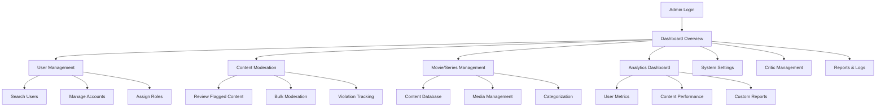

# LemonPie Admin Frontend Interface - Product Requirements Document

## 1. Product Overview

The LemonPie Admin Frontend Interface is a comprehensive administrative dashboard designed for platform administrators to manage users, content, and system operations. It provides a centralized control panel for monitoring platform health, moderating content, managing user accounts, and maintaining the overall quality of the movie review platform.

- The admin interface enables efficient management of all platform aspects including user accounts, movie/series content, review moderation, and system analytics.
- Target administrators and moderators who need powerful tools to maintain platform quality, user safety, and content integrity.

## 2. Core Features

### 2.1 User Roles

| Role | Registration Method | Core Permissions |
|------|---------------------|------------------|
| Super Admin | System-level assignment | Full system access, user role management, system configuration |
| Admin | Invitation by Super Admin | User management, content moderation, analytics access |
| Moderator | Invitation by Admin/Super Admin | Content moderation, basic user management, limited analytics |

### 2.2 Feature Module

Our admin interface requirements consist of the following main pages:

1. **Dashboard Overview**: Key metrics display, system health monitoring, quick action panel, recent activity feed.
2. **User Management**: User search and filtering, account status management, role assignment, user analytics.
3. **Content Moderation**: Review flagging system, content approval workflow, bulk moderation tools, violation tracking.
4. **Movie/Series Management**: Content database management, metadata editing, poster/image management, content categorization.
5. **Analytics Dashboard**: User engagement metrics, content performance analytics, platform growth statistics, custom reporting.
6. **System Settings**: Platform configuration, feature toggles, notification settings, security parameters.
7. **Critic Management**: Critic verification workflow, badge assignment, verification level management, critic analytics.
8. **Reports & Logs**: User reports management, system logs viewing, audit trail, violation reports.

### 2.3 Page Details

| Page Name | Module Name | Feature description |
|-----------|-------------|---------------------|
| Dashboard Overview | Key Metrics Panel | Display total users, reviews, engagement rates, and growth percentages with visual indicators |
| Dashboard Overview | System Health Monitor | Show server status, database health, API response times, and system alerts |
| Dashboard Overview | Quick Actions Panel | Provide shortcuts for broadcast messages, data export, system maintenance, and log viewing |
| Dashboard Overview | Recent Activity Feed | List recent user registrations, content additions, flagged reviews, and system events |
| User Management | User Search & Filter | Search users by name/email, filter by role/status/registration date, sort by various criteria |
| User Management | Account Management | View user profiles, edit user information, suspend/unsuspend accounts, delete users |
| User Management | Role Assignment | Assign/modify user roles (user/critic/moderator/admin), manage permissions, bulk role changes |
| User Management | User Analytics | Display user statistics, review history, engagement metrics, violation history |
| Content Moderation | Review Flagging System | View flagged reviews, categorize violations, approve/reject content, assign severity levels |
| Content Moderation | Bulk Moderation Tools | Select multiple items for bulk actions, apply moderation decisions, export moderation reports |
| Content Moderation | Violation Tracking | Track repeat offenders, monitor violation patterns, escalate serious violations |
| Movie/Series Management | Content Database | Add new movies/series, edit existing content, manage metadata, organize by categories |
| Movie/Series Management | Media Management | Upload/edit posters, manage image galleries, handle video trailers, optimize media files |
| Movie/Series Management | Content Categorization | Assign genres, set content ratings, manage tags, create content collections |
| Analytics Dashboard | User Engagement Metrics | Track active users, session duration, feature usage, user retention rates |
| Analytics Dashboard | Content Performance | Analyze most reviewed content, rating distributions, trending movies, user preferences |
| Analytics Dashboard | Growth Statistics | Monitor user acquisition, content addition rates, platform expansion metrics |
| Analytics Dashboard | Custom Reporting | Generate custom reports, export analytics data, schedule automated reports |
| System Settings | Platform Configuration | Manage site settings, feature toggles, API configurations, third-party integrations |
| System Settings | Security Parameters | Configure authentication settings, rate limiting, IP blocking, security policies |
| System Settings | Notification Management | Set up system notifications, email templates, push notification settings |
| Critic Management | Verification Workflow | Review critic applications, verify credentials, approve/reject applications |
| Critic Management | Badge Assignment | Assign critic badges, set verification levels, manage critic privileges |
| Critic Management | Critic Analytics | Track critic performance, review quality metrics, influence measurements |
| Reports & Logs | User Reports Management | Handle user-submitted reports, investigate complaints, take appropriate actions |
| Reports & Logs | System Logs | View application logs, error tracking, performance monitoring, security events |
| Reports & Logs | Audit Trail | Track admin actions, user modifications, system changes, compliance reporting |

## 3. Core Process

### Admin User Flow
1. **Login & Authentication**: Admin logs in with elevated credentials → Dashboard overview displays
2. **Daily Monitoring**: Review key metrics → Check flagged content → Process user reports → Monitor system health
3. **User Management**: Search for specific users → Review user profiles → Take moderation actions → Update user roles
4. **Content Moderation**: Review flagged reviews → Categorize violations → Apply moderation decisions → Track repeat offenders
5. **Content Management**: Add new movies/series → Edit existing content → Manage media assets → Organize content categories
6. **Analytics Review**: Generate performance reports → Analyze user engagement → Monitor growth trends → Export data for stakeholders

### Moderator User Flow
1. **Login & Limited Access**: Moderator logs in → Access content moderation dashboard
2. **Content Review**: Review flagged content → Apply moderation decisions → Escalate serious violations
3. **Basic User Management**: View user profiles → Apply temporary suspensions → Report serious violations to admins

## 4. User Interface Design

### 4.1 Design Style

- **Primary Colors**: Gold (#FFD700) for primary actions, Dark Blue (#0f172a) for backgrounds
- **Secondary Colors**: Blue (#3b82f6) for accents, Green (#10b981) for success states, Red (#ef4444) for warnings
- **Button Style**: Rounded corners (8px), subtle shadows, hover state animations, consistent sizing
- **Typography**: System font stack (-apple-system, BlinkMacSystemFont, 'Segoe UI'), 16px base size, clear hierarchy
- **Layout Style**: Sidebar navigation, card-based content areas, responsive grid system, consistent spacing (8px grid)
- **Icon Style**: Lucide Vue icons, 16px-24px sizes, consistent stroke width, contextual colors

### 4.2 Page Design Overview

| Page Name | Module Name | UI Elements |
|-----------|-------------|-------------|
| Dashboard Overview | Key Metrics Panel | Large metric cards with icons, percentage change indicators, color-coded growth trends, responsive grid layout |
| Dashboard Overview | System Health Monitor | Status badges (green/yellow/red), real-time indicators, alert notifications, expandable details |
| Dashboard Overview | Quick Actions Panel | Icon buttons with labels, dropdown menus, modal dialogs, confirmation prompts |
| User Management | User Search & Filter | Search input with autocomplete, filter dropdowns, sortable table headers, pagination controls |
| User Management | User Table | Avatar thumbnails, role badges, status indicators, action buttons, expandable rows |
| Content Moderation | Flagged Content List | Content preview cards, severity indicators, action buttons, bulk selection checkboxes |
| Content Moderation | Moderation Actions | Modal dialogs, reason selection dropdowns, text areas for notes, confirmation buttons |
| Movie/Series Management | Content Grid | Poster thumbnails, title overlays, edit buttons, drag-and-drop functionality |
| Movie/Series Management | Content Form | Multi-step forms, image upload areas, tag inputs, rich text editors |
| Analytics Dashboard | Charts & Graphs | Interactive line charts, bar graphs, pie charts, data tooltips, legend controls |
| Analytics Dashboard | Data Tables | Sortable columns, export buttons, date range pickers, filter controls |
| System Settings | Configuration Forms | Toggle switches, input fields, dropdown selectors, save/cancel buttons |
| Critic Management | Application Review | Document viewers, approval buttons, rejection forms, verification checklists |
| Reports & Logs | Log Viewer | Searchable text areas, filter controls, export options, real-time updates |

### 4.3 Responsiveness

The admin interface is desktop-first with mobile-adaptive design considerations:
- **Desktop (1200px+)**: Full sidebar navigation, multi-column layouts, expanded data tables
- **Tablet (768px-1199px)**: Collapsible sidebar, stacked content areas, simplified tables
- **Mobile (320px-767px)**: Bottom navigation, single-column layout, touch-optimized controls
- **Touch Optimization**: Larger touch targets (44px minimum), swipe gestures for navigation, pull-to-refresh functionality