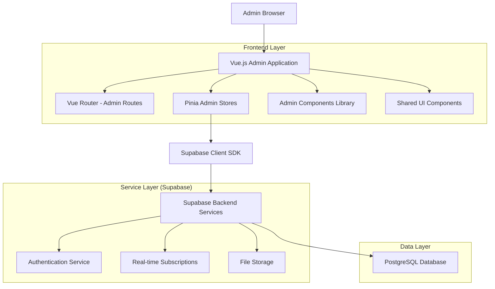
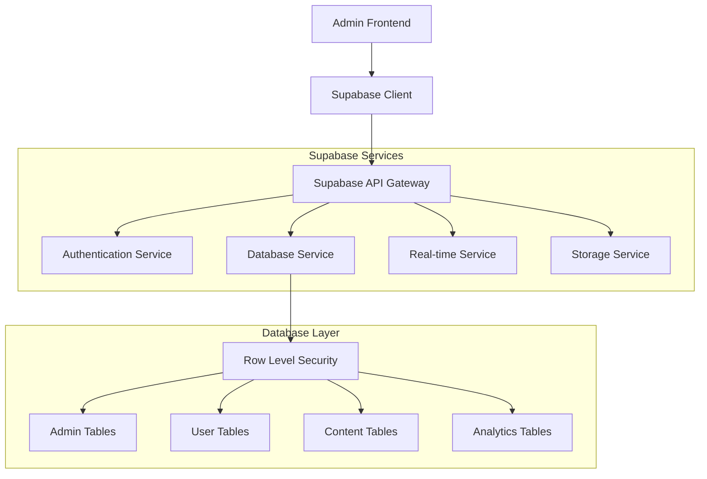
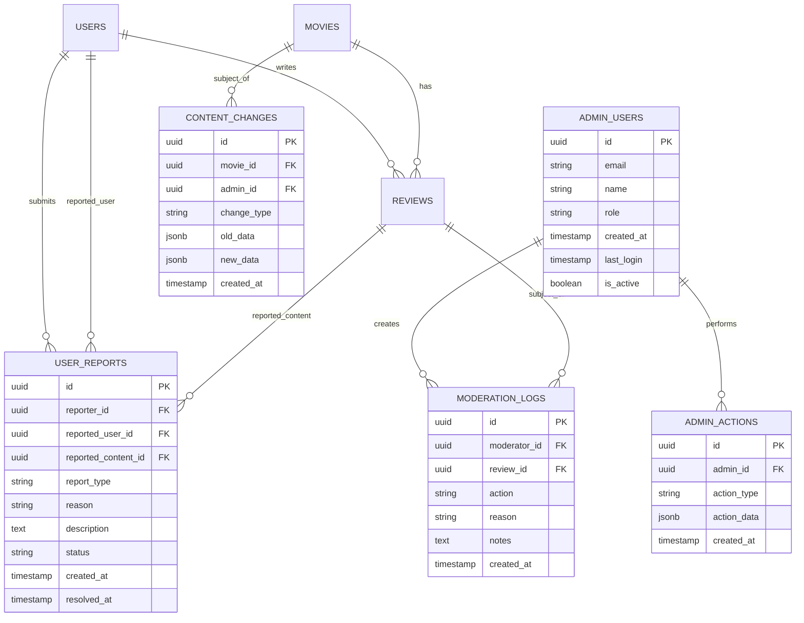

# LemonPie Admin Frontend Interface - Technical Architecture Document

## 1. Architecture Design



## 2. Technology Description

- Frontend: Vue.js@3 + TypeScript + Vite + Vue Router + Pinia
- UI Framework: Tailwind CSS@3 + DaisyUI + Lucide Vue Icons
- Charts & Analytics: Chart.js + Vue-Chartjs
- Backend: Supabase (Authentication, Database, Real-time, Storage)
- Database: PostgreSQL (via Supabase)

## 3. Route Definitions

| Route | Purpose |
|-------|---------|
| /admin | Admin dashboard overview with key metrics and system health |
| /admin/users | User management interface with search, filter, and account actions |
| /admin/users/:id | Individual user profile view and editing interface |
| /admin/moderation | Content moderation dashboard for reviewing flagged content |
| /admin/moderation/reviews | Specific review moderation with bulk actions |
| /admin/content | Movie/series database management interface |
| /admin/content/add | Add new movie or series content form |
| /admin/content/:id/edit | Edit existing movie/series content and metadata |
| /admin/analytics | Analytics dashboard with charts and performance metrics |
| /admin/analytics/reports | Custom report generation and export interface |
| /admin/settings | System configuration and platform settings |
| /admin/settings/security | Security parameters and authentication settings |
| /admin/critics | Critic verification and badge management interface |
| /admin/critics/applications | Review pending critic applications |
| /admin/reports | User reports and violation management |
| /admin/logs | System logs and audit trail viewer |

## 4. API Definitions

### 4.1 Core Admin APIs

**User Management**
```
GET /api/admin/users
```
Request:
| Param Name | Param Type | isRequired | Description |
|------------|------------|------------|-------------|
| page | number | false | Page number for pagination |
| limit | number | false | Number of users per page |
| search | string | false | Search term for user name/email |
| role | string | false | Filter by user role |
| status | string | false | Filter by account status |

Response:
| Param Name | Param Type | Description |
|------------|------------|-------------|
| users | User[] | Array of user objects |
| total | number | Total number of users |
| page | number | Current page number |
| totalPages | number | Total number of pages |

**Content Moderation**
```
POST /api/admin/moderation/review
```
Request:
| Param Name | Param Type | isRequired | Description |
|------------|------------|------------|-------------|
| reviewId | string | true | ID of the review to moderate |
| action | string | true | Moderation action (approve/reject/flag) |
| reason | string | false | Reason for moderation action |
| notes | string | false | Additional moderator notes |

Response:
| Param Name | Param Type | Description |
|------------|------------|-------------|
| success | boolean | Whether the action was successful |
| message | string | Status message |

**Analytics Data**
```
GET /api/admin/analytics/metrics
```
Request:
| Param Name | Param Type | isRequired | Description |
|------------|------------|------------|-------------|
| startDate | string | true | Start date for analytics period |
| endDate | string | true | End date for analytics period |
| metric | string | false | Specific metric to retrieve |

Response:
| Param Name | Param Type | Description |
|------------|------------|-------------|
| metrics | object | Analytics data object |
| period | object | Date range information |

## 5. Server Architecture Diagram



## 6. Data Model

### 6.1 Data Model Definition



### 6.2 Data Definition Language

**Admin Users Table**
```sql
-- Create admin users table
CREATE TABLE admin_users (
    id UUID PRIMARY KEY DEFAULT gen_random_uuid(),
    email VARCHAR(255) UNIQUE NOT NULL,
    name VARCHAR(100) NOT NULL,
    role VARCHAR(20) DEFAULT 'moderator' CHECK (role IN ('super_admin', 'admin', 'moderator')),
    created_at TIMESTAMP WITH TIME ZONE DEFAULT NOW(),
    last_login TIMESTAMP WITH TIME ZONE,
    is_active BOOLEAN DEFAULT true
);

-- Create admin actions audit table
CREATE TABLE admin_actions (
    id UUID PRIMARY KEY DEFAULT gen_random_uuid(),
    admin_id UUID REFERENCES admin_users(id) ON DELETE CASCADE,
    action_type VARCHAR(50) NOT NULL,
    action_data JSONB,
    created_at TIMESTAMP WITH TIME ZONE DEFAULT NOW()
);

-- Create moderation logs table
CREATE TABLE moderation_logs (
    id UUID PRIMARY KEY DEFAULT gen_random_uuid(),
    moderator_id UUID REFERENCES admin_users(id) ON DELETE SET NULL,
    review_id UUID REFERENCES reviews(id) ON DELETE CASCADE,
    action VARCHAR(20) NOT NULL CHECK (action IN ('approve', 'reject', 'flag', 'unflag')),
    reason VARCHAR(100),
    notes TEXT,
    created_at TIMESTAMP WITH TIME ZONE DEFAULT NOW()
);

-- Create user reports table
CREATE TABLE user_reports (
    id UUID PRIMARY KEY DEFAULT gen_random_uuid(),
    reporter_id UUID REFERENCES users(id) ON DELETE SET NULL,
    reported_user_id UUID REFERENCES users(id) ON DELETE SET NULL,
    reported_content_id UUID, -- Can reference reviews, comments, etc.
    report_type VARCHAR(20) NOT NULL CHECK (report_type IN ('user', 'review', 'comment')),
    reason VARCHAR(50) NOT NULL,
    description TEXT,
    status VARCHAR(20) DEFAULT 'pending' CHECK (status IN ('pending', 'investigating', 'resolved', 'dismissed')),
    created_at TIMESTAMP WITH TIME ZONE DEFAULT NOW(),
    resolved_at TIMESTAMP WITH TIME ZONE
);

-- Create content changes audit table
CREATE TABLE content_changes (
    id UUID PRIMARY KEY DEFAULT gen_random_uuid(),
    movie_id UUID REFERENCES movies(id) ON DELETE CASCADE,
    admin_id UUID REFERENCES admin_users(id) ON DELETE SET NULL,
    change_type VARCHAR(20) NOT NULL CHECK (change_type IN ('create', 'update', 'delete')),
    old_data JSONB,
    new_data JSONB,
    created_at TIMESTAMP WITH TIME ZONE DEFAULT NOW()
);

-- Create indexes for performance
CREATE INDEX idx_admin_actions_admin_id ON admin_actions(admin_id);
CREATE INDEX idx_admin_actions_created_at ON admin_actions(created_at DESC);
CREATE INDEX idx_moderation_logs_moderator_id ON moderation_logs(moderator_id);
CREATE INDEX idx_moderation_logs_review_id ON moderation_logs(review_id);
CREATE INDEX idx_moderation_logs_created_at ON moderation_logs(created_at DESC);
CREATE INDEX idx_user_reports_status ON user_reports(status);
CREATE INDEX idx_user_reports_created_at ON user_reports(created_at DESC);
CREATE INDEX idx_content_changes_movie_id ON content_changes(movie_id);
CREATE INDEX idx_content_changes_created_at ON content_changes(created_at DESC);

-- Row Level Security policies
ALTER TABLE admin_users ENABLE ROW LEVEL SECURITY;
ALTER TABLE admin_actions ENABLE ROW LEVEL SECURITY;
ALTER TABLE moderation_logs ENABLE ROW LEVEL SECURITY;
ALTER TABLE user_reports ENABLE ROW LEVEL SECURITY;
ALTER TABLE content_changes ENABLE ROW LEVEL SECURITY;

-- Admin access policies
CREATE POLICY "Admin users can view all admin data" ON admin_users
    FOR ALL USING (auth.jwt() ->> 'role' IN ('admin', 'super_admin'));

CREATE POLICY "Admins can view all actions" ON admin_actions
    FOR ALL USING (auth.jwt() ->> 'role' IN ('admin', 'super_admin', 'moderator'));

CREATE POLICY "Moderators can view moderation logs" ON moderation_logs
    FOR ALL USING (auth.jwt() ->> 'role' IN ('admin', 'super_admin', 'moderator'));

CREATE POLICY "Admins can manage user reports" ON user_reports
    FOR ALL USING (auth.jwt() ->> 'role' IN ('admin', 'super_admin', 'moderator'));

CREATE POLICY "Admins can view content changes" ON content_changes
    FOR ALL USING (auth.jwt() ->> 'role' IN ('admin', 'super_admin'));

-- Initial admin user data
INSERT INTO admin_users (email, name, role) VALUES
('admin@lemonpie.com', 'System Administrator', 'super_admin'),
('moderator@lemonpie.com', 'Content Moderator', 'moderator');
```