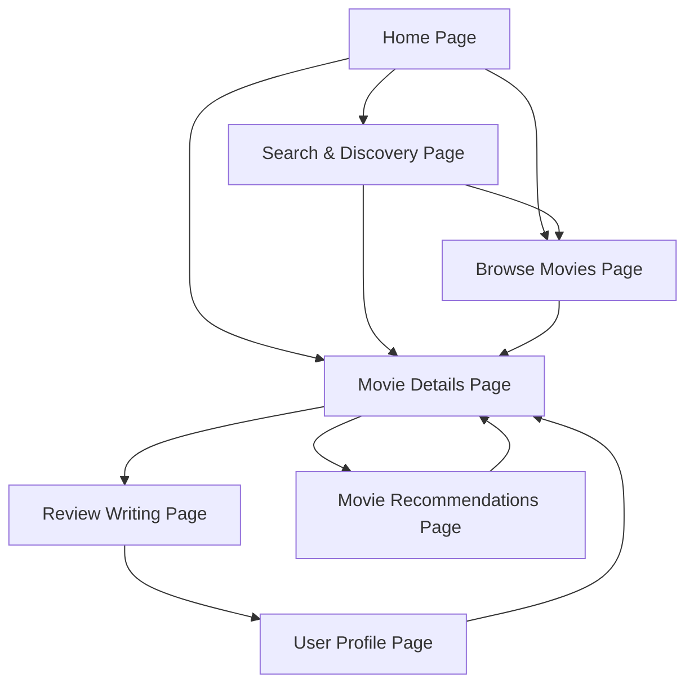

## 1. Product Overview
LemonNPie is a comprehensive Nollywood movie review platform that allows users to discover, rate, and review Nigerian films using a unique Lemon/Pie rating system (1-4 = Lemon 🍋 for disappointing films, 7-10 = Pie 🥧 for exceptional movies).

The platform serves as a community-driven database celebrating Nigerian cinema while helping audiences discover quality films and avoid disappointing ones. Built with Vue.js 3 and DaisyUI, it targets Nigerian audiences and diaspora communities worldwide.

## 2. Core Features

### 2.1 User Roles
| Role | Registration Method | Core Permissions |
|------|---------------------|------------------|
| Guest User | No registration required | Browse movies, read reviews, basic search |
| Registered User | Email registration | Write reviews, rate movies, create watchlists, follow users |
| Verified Critic | Application and approval | All user features plus verified badge, priority placement |

### 2.2 Feature Module
Our Nollywood review platform consists of the following main pages:
1. **Home page**: hero section with featured movies, trending reviews carousel, latest pies/lemons sections, Nollywood news.
2. **Movie details page**: movie information, LemonNPie score display, reviews section, cast/crew details, recommendations.
3. **Search & discovery page**: movie search with filters, genre browsing, trending movies, regional showcases.
4. **Review writing page**: rich text editor, LemonNPie rating slider, category ratings, spoiler warnings.
5. **User profile page**: profile information, review history, watchlists, following/followers, activity feed.
6. **Browse movies page**: movie catalog with pagination, filtering by genre/year/rating/language/region.
7. **Movie recommendations page**: personalized suggestions, similar movies, genre-based recommendations.

### 2.3 Page Details
| Page Name | Module Name | Feature description |
|-----------|-------------|---------------------|
| Home page | Hero section | Display featured Nollywood movies with rotating banners and key information |
| Home page | Latest Pies section | Show top-rated new releases (7-10 rating) with visual pie indicators |
| Home page | Fresh Lemons section | Display recent disappointments (1-4 rating) to help users avoid |
| Home page | Trending reviews | Carousel of popular reviews with user ratings and snippets |
| Home page | Nollywood news | "This Week in Nollywood" section with industry updates |
| Movie details page | Movie information | Display title, local title, release date, runtime, genre, language, cast, plot |
| Movie details page | LemonNPie score | Show overall rating with visual Lemon/Pie indicators and distribution |
| Movie details page | Reviews section | List user and critic reviews with helpfulness voting and filtering |
| Movie details page | Cast & crew | Display filmography links and Nollywood career information |
| Movie details page | Recommendations | Show similar Nollywood movies and related suggestions |
| Movie details page | Where to watch | List Nigerian cinemas and streaming platforms availability |
| Search & discovery page | Search functionality | Movie title search with autocomplete in English and local languages |
| Search & discovery page | Advanced filters | Filter by genre, year, rating, language, production state, awards |
| Search & discovery page | Genre browsing | Browse Nollywood categories like Comedy, Drama, Epic, Thriller |
| Search & discovery page | Regional showcase | Highlight productions from Lagos, Enugu, Kano, Abuja regions |
| Review writing page | Rich text editor | Format review text with styling options and media attachments |
| Review writing page | LemonNPie rating | Interactive slider with visual feedback from Lemon to Pie |
| Review writing page | Category ratings | Rate Story, Acting, Cinematography, Production Quality, Cultural Authenticity |
| Review writing page | Spoiler controls | Toggle spoiler warnings and preview functionality |
| Review writing page | Language support | Write reviews in English, Igbo, Yoruba, Hausa, or Pidgin |
| User profile page | Profile information | Display username, bio, profile picture, verification status |
| User profile page | Review history | List all user reviews with ratings and engagement metrics |
| User profile page | Watchlists | Manage personal movie watchlists and custom lists |
| User profile page | Social features | Show following/followers count and activity feed |
| Browse movies page | Movie catalog | Paginated list of all Nollywood movies with poster thumbnails |
| Browse movies page | Filtering system | Filter movies by multiple criteria with real-time results |
| Browse movies page | Sorting options | Sort by rating, release date, popularity, alphabetical order |
| Movie recommendations page | Personalized suggestions | AI-driven recommendations based on user viewing history |
| Movie recommendations page | Similar movies | Show movies similar to currently viewed film |
| Movie recommendations page | Genre recommendations | Suggest movies within preferred Nollywood genres |

## 3. Core Process
**Guest User Flow:**
Guest users can browse the homepage to discover featured movies and trending content. They can search for specific Nollywood films, view detailed movie information including ratings and reviews, and explore different genres and regional productions. However, they cannot write reviews or create personal lists.

**Registered User Flow:**
Registered users have full access to browse and discover content. They can write detailed reviews with LemonNPie ratings, create and manage watchlists, follow other users and critics, and engage with reviews through likes and comments. They can also customize their profiles and track their review history.

**Verified Critic Flow:**
Verified critics have all registered user capabilities plus enhanced features. Their reviews receive priority placement, they display verified badges, and they have access to advanced analytics and bulk import tools for existing reviews.

## 4. User Interface Design
### 4.1 Design Style
- **Primary Colors**: Nollywood Gold (#FFD700) and Nigerian Green (#008751)
- **Accent Colors**: Vibrant Orange (#FF6B35), Lemon Yellow (#FFEB3B), Pie Brown (#8D4E2A)
- **Background**: Deep Navy (#1A1B2E) for dark mode, Cream White (#FFF8E1) for light mode
- **Button Style**: Rounded corners with subtle shadows, 3D effect on hover
- **Typography**: Modern sans-serif fonts, 16px base size, bold headings
- **Layout**: Card-based design with top navigation, responsive grid system
- **Icons**: Nollywood-themed emojis (🍋🥧) and cultural symbols, clean line icons

### 4.2 Page Design Overview
| Page Name | Module Name | UI Elements |
|-----------|-------------|-------------|
| Home page | Hero section | Full-width banner with movie posters, gradient overlays, animated transitions |
| Home page | Latest Pies section | Card grid with pie icons, gold accents, rating badges |
| Home page | Fresh Lemons section | Warning-style cards with lemon icons, yellow highlights |
| Movie details page | LemonNPie score | Large circular progress indicator, color-coded Lemon/Pie visual |
| Movie details page | Reviews section | Expandable cards with user avatars, rating stars, helpful buttons |
| Review writing page | Rating slider | Interactive slider with emoji feedback, color transitions |
| User profile page | Statistics | Dashboard-style widgets with charts and progress bars |

### 4.3 Responsiveness
The platform is mobile-first with responsive design optimized for Nigerian mobile users. Touch interactions are prioritized for rating sliders and navigation. The design adapts seamlessly from mobile (320px) to desktop (1920px) with appropriate breakpoints for tablet viewing.
